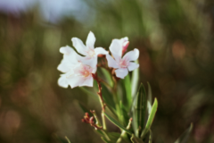
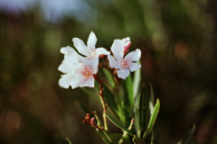
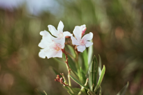
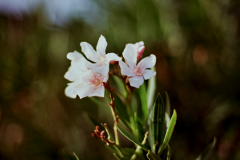
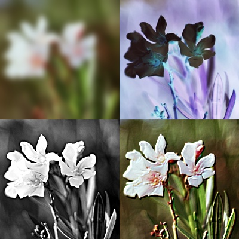

[English](./README.md)
# Imaging

[](https://godoc.org/github.com/disintegration/imaging)
[](https://travis-ci.org/disintegration/imaging)
[](https://coveralls.io/github/disintegration/imaging?branch=master)

Imaging 基于 Go 语言图片标准库实现对图片调整尺寸、翻转、裁剪等常用的图片处理功能。

## 支持的图片类型

Imaging 支持读取任何图片，并转换成 `*image.NRGBA` （32位 RGBA 图像）。

imaging.Save() 支持保存任何类型图片为以下后缀：

* JPEG: .jpg, .jpeg
* PNG : .png
* TIFF: .tif
* TIFF: .tiff
* BMP : .bmp
* GIF : .gif 
* WEBP: .webp 

## Todo
* 保持图片为渐进式
* 编码保存 Webp 图片

## 如何安装

环境：Go 1.2 及以上

    go get -u github.com/disintegration/imaging
    
## 文档

http://godoc.org/github.com/disintegration/imaging

## 使用说明

下面只是一部分使用案例，更多使用方法请参考文档 

### 图片拉伸和裁剪

```go
// 使用 Lanczos 滤波调整图片尺寸为 128x128 像素
dstImage128 := imaging.Resize(srcImage, 128, 128, imaging.Lanczos)

// 保持等比例调整图片宽度为 800 像素
dstImage800 := imaging.Resize(srcImage, 800, 0, imaging.Lanczos)

// 调整图片尺寸在 800x600 像素边界以内.
dstImageFit := imaging.Fit(srcImage, 800, 600, imaging.Lanczos)

// 缩放及裁剪图片尺寸，使其在 100x100 像素边界内.
dstImageFill := imaging.Fill(srcImage, 100, 100, imaging.Center, imaging.Lanczos)
```

Imaging supports image resizing using various resampling filters. The most notable ones:
- `NearestNeighbor` - Fastest resampling filter, no antialiasing.
- `Box` - Simple and fast averaging filter appropriate for downscaling. When upscaling it's similar to NearestNeighbor.
- `Linear` - Bilinear filter, smooth and reasonably fast.
- `MitchellNetravali` - А smooth bicubic filter.
- `CatmullRom` - A sharp bicubic filter. 
- `Gaussian` - Blurring filter that uses gaussian function, useful for noise removal.
- `Lanczos` - High-quality resampling filter for photographic images yielding sharp results, but it's slower than cubic filters.

Imaging 支持的滤波类型:  NearestNeighbor, Box, Linear, Hermite, MitchellNetravali, CatmullRom, BSpline, Gaussian, Lanczos, Hann, Hamming, Blackman, Bartlett, Welch, Cosine. 可以使用 ResampleFilter 自定义滤波类型。

**重采样滤波器比较**

原图：


使用不同的重采样滤波去调整相同图片（原始尺寸为：512x512 像素）为 128x128 像素。
以下处理效率递减，图片质量递增

滤波类型                   | 尺寸调整效果
--------------------------|---------------------------------------------
`imaging.NearestNeighbor` |  
`imaging.Linear`          | 
`imaging.CatmullRom`      | 
`imaging.Lanczos`         | 


### 高斯模糊

```go
dstImage := imaging.Blur(srcImage, 0.5)
```
参数 Sigma 用于控制模糊效果

原图                               | Sigma = 0.5                            | Sigma = 1.5
-----------------------------------|----------------------------------------|---------------------------------------
 |  | 

### 锐度

```go
dstImage := imaging.Sharpen(srcImage, 0.5)
```

`Sharpen` 使用高斯函数实现。参数 Sigma 用于控制锐度效果。

原图                               | Sigma = 0.5                               | Sigma = 1.5
-----------------------------------|-------------------------------------------|------------------------------------------
 |  | 

### 伽玛校正

```go
dstImage := imaging.AdjustGamma(srcImage, 0.75)
```

原图                               | 伽玛(Gamma) = 0.75                        | 伽玛(Gamma) = 1.25
-----------------------------------|------------------------------------------|-----------------------------------------
 |  | 

### 对比度

```go
dstImage := imaging.AdjustContrast(srcImage, 20)
```

原图                               | 对比度(Contrast) = 10                        | 对比度(Contrast) = -10
-----------------------------------|--------------------------------------------|-------------------------------------------
 |  | 

### 亮度

```go
dstImage := imaging.AdjustBrightness(srcImage, 20)
```

原图                                | 亮度(Brightness) = 10                        | 亮度(Brightness) = -10
-----------------------------------|----------------------------------------------|---------------------------------------------
 |  | 

## 代码示例

```go
package main

import (
	"image"
	"image/color"
	"log"

	"github.com/disintegration/imaging"
)

func main() {
	// 读取图片
	src, err := imaging.Open("testdata/lena_512.png")
	if err != nil {
		log.Fatalf("Open failed: %v", err)
	}

	// 居中裁剪原图为 350x350 像素
	src = imaging.CropAnchor(src, 350, 350, imaging.Center)

	// 等比例缩放图片，使其宽度保持 256 像素
	src = imaging.Resize(src, 256, 0, imaging.Lanczos)

	// 模糊化图片
	img1 := imaging.Blur(src, 2)

	// 使用高对比度和锐度，创建一个灰度图像
	img2 := imaging.Grayscale(src)
	img2 = imaging.AdjustContrast(img2, 20)
	img2 = imaging.Sharpen(img2, 2)

	// 创建一个倒转的图片
	img3 := imaging.Invert(src)

	// 使用卷积（convolution）创建浮雕图像
	img4 := imaging.Convolve3x3(
		src,
		[9]float64{
			-1, -1, 0,
			-1, 1, 1,
			0, 1, 1,
		},
		nil,
	)

	// 图片覆盖，可用于图片加水印
	dst := imaging.New(512, 512, color.NRGBA{0, 0, 0, 0})
	dst = imaging.Paste(dst, img1, image.Pt(0, 0))
	dst = imaging.Paste(dst, img2, image.Pt(0, 256))
	dst = imaging.Paste(dst, img3, image.Pt(256, 0))
	dst = imaging.Paste(dst, img4, image.Pt(256, 256))

	// 保存图片
	err = imaging.Save(dst, "testdata/out_example.jpg")
	if err != nil {
		log.Fatalf("Save failed: %v", err)
	}
}
```

输出：

